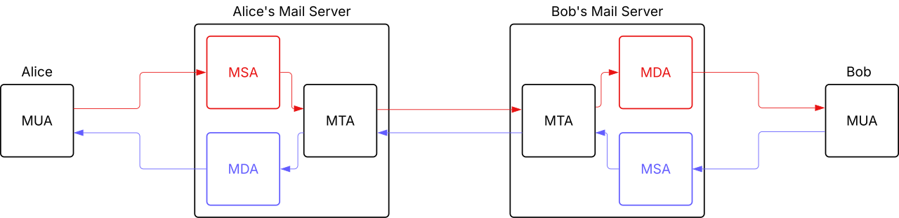

# Mail Transfer Agent (MTA)

## Definition

A **Mail Transfer Agent (MTA)** is a server component responsible for **transferring emails between mail servers** using the **SMTP protocol**.

## Main Responsibilities

- Receive outgoing emails from a client (MUA)
- Route emails to the correct destination server
- Communicate with other MTAs over the internet
- Queue emails if the destination is temporarily unavailable
- Deliver emails to a local delivery system (MDA)

## Protocol

- **SMTP (Simple Mail Transfer Protocol)**

## Common Ports

| Port | Purpose |
|------|--------|
| 25   | Server-to-server mail transfer (SMTP) |
| 587  | Mail submission (authenticated SMTP) |
| 465  | SMTP over SSL (legacy but still used) |

## How Email Flows

1. User sends an email from a client (MUA)
2. Email is sent to the local MTA
3. MTA looks up recipient domain via DNS (MX record)
4. MTA connects to the recipient’s MTA
5. Email is delivered or queued if unavailable

## MTA vs Other Components

| Component | Role |
|----------|------|
| MUA | Email client (Thunderbird, Gmail) |
| MTA | Transfers emails between servers |
| MDA | Stores emails in mailbox |
| IMAP/POP3 | Lets users read emails |

## What an MTA Does NOT Do

- It does NOT store emails long-term
- It does NOT provide user interface
- It does NOT display emails

## Security Considerations

- Use TLS encryption for SMTP
- Configure authentication (for port 587)
- Protect against open relay (very important)
- Implement SPF, DKIM, and DMARC (DNS-based protections)

## Key Concepts

- **Relay**: forwarding email to another server
- **Queue**: temporary storage if delivery fails
- **MX record**: DNS record used to find mail servers
- **Open relay**: insecure server that allows anyone to send mail (must be avoided)
